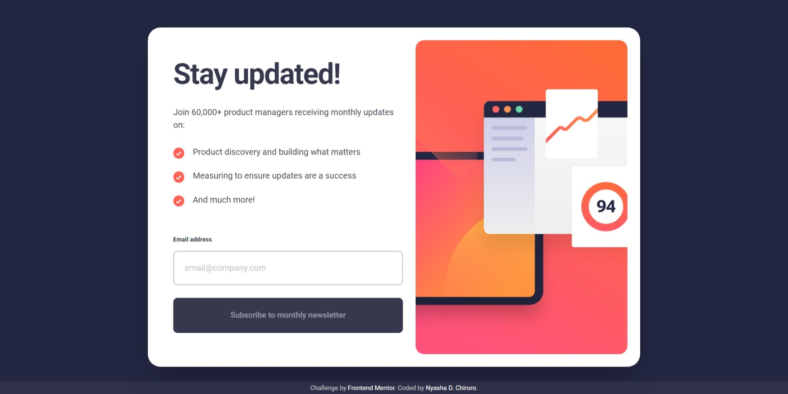

# Frontend Mentor - Newsletter sign-up form with success message solution

This is a solution to the [Newsletter sign-up form with success message challenge on Frontend Mentor](https://www.frontendmentor.io/challenges/newsletter-signup-form-with-success-message-3FC1AZbNrv). Frontend Mentor challenges help you improve your coding skills by building realistic projects.

## Table of contents

-   [Frontend Mentor - Newsletter sign-up form with success message solution](#frontend-mentor---newsletter-sign-up-form-with-success-message-solution)
    -   [Table of contents](#table-of-contents)
    -   [Overview](#overview)
        -   [The challenge](#the-challenge)
        -   [Screenshot](#screenshot)
        -   [Links](#links)
    -   [My process](#my-process)
        -   [Built with](#built-with)
    -   [Author](#author)

## Overview

### The challenge

Users should be able to:

-   Add their email and submit the form
-   See a success message with their email after successfully submitting the form
-   See form validation messages if:
    -   The field is left empty
    -   The email address is not formatted correctly
-   View the optimal layout for the interface depending on their device's screen size
-   See hover and focus states for all interactive elements on the page

### Screenshot

### Links

-   Solution URL: [https://www.frontendmentor.io/solutions/newsletter-signup-and-success-message-using-tailwindcss-vite-and-html-qRSGS5bZfy](https://www.frontendmentor.io/solutions/newsletter-signup-and-success-message-using-tailwindcss-vite-and-html-qRSGS5bZfy)
-   Live Site URL: [https://newsletter-sign-up-ndc.netlify.app/](https://newsletter-sign-up-ndc.netlify.app/)

## My process

### Built with

-   Semantic HTML5 markup
-   [TailwindCSS](https://tailwindcss.com/)
-   Flexbox
-   CSS Grid
-   Mobile-first workflow
-   [Vite](https://vitejs.dev/) - Next gen frontend tooling

## Author

-   Frontend Mentor - [@chiroro-jr](https://www.frontendmentor.io/profile/chiroro-jr)
-   Twitter - [@chiroro-jr](https://www.twitter.com/chiroro-jr)
